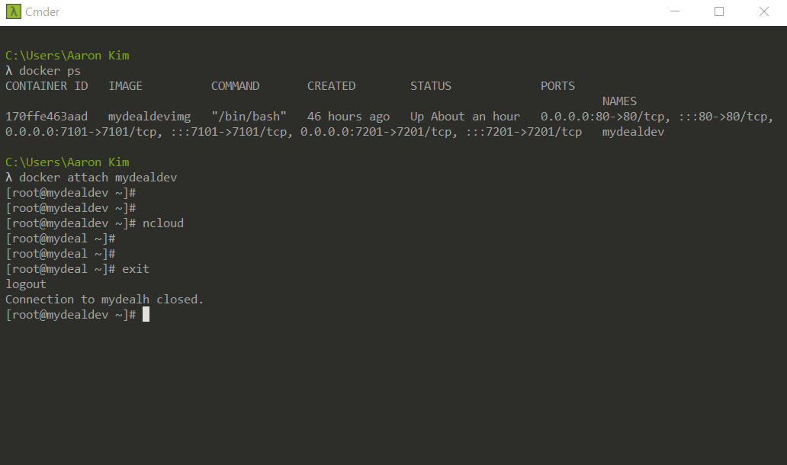
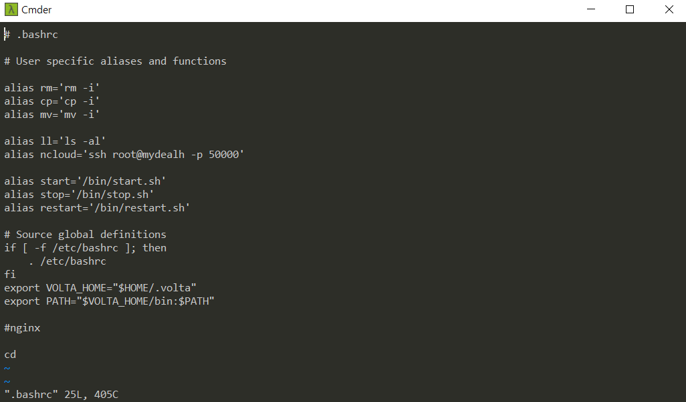
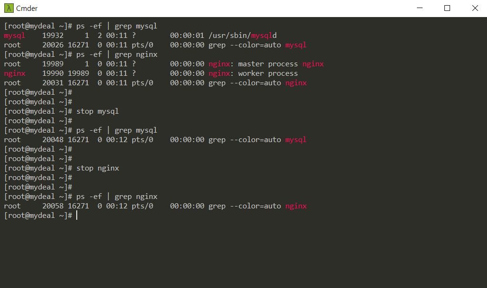
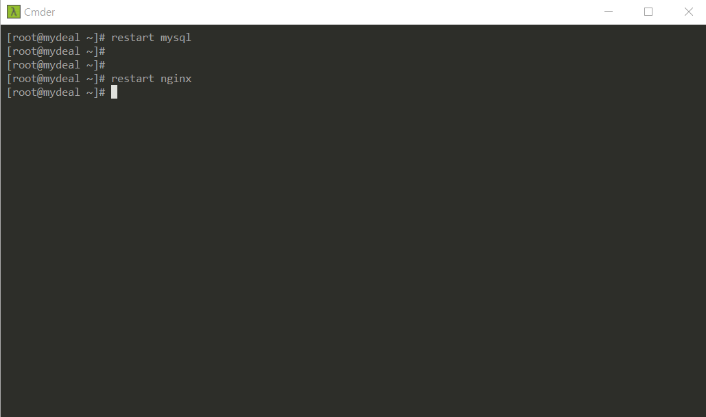

## 싹 풀스택 8월 2주차 과제 제출 (김민수)

### 제출기한: 21.08.21 토

#

### 과제1

1.  - [x] `$> ncloud` 접속 완료 화면  
          

     

2.  - [x] local PC에 MySQL Workbench 설치 후,  
          NCP MySQL로 connection test 시 "successful" 나온 화면  
          

     

3.  - [x] Browser  
          https 인증된 본인 도메인 -> 접속 화면  
          

#

### 과제2

- .bashrc 파일

  

 

1.  - [x] `start.sh` 생성 (~/bin/)  

    start mysql  
    start nginx

    

     

    

   

2.  - [x] `stop.sh 생성`  

    stop mysql  
    stop nginx

    

     

    

   

3.  - [x] `restart.sh` 생성  

    restart mysql  
    restart nginx

    

     

    

### [유의사항]

- 쉘스크립트는 if문 등을 이용해 start만 입력하고 뒤 내용을 입력하지 않으면  
  경고문을 출력하던가 하는 예외상황 처리까지 하면 더 좋은점수를 받을 수 있음

- 작업공간 : 본인 ncp ~/bin 경로에 쓰기  
- 제출방법 : 본인 깃허브에 업로드 후 링크 공유 혹은 본인 ncp 공유

### [Note]

- github repository 만들어 놓고 과제 소스 관리하면 좋음
- 로컬 PC에 workspace 정해놓고 프로젝트별로 관리  
  (하나는 관리자용, 다른 하나는 고객용  
  실무에서 프로젝트 폴더 안에 레포지토리 두 개 따로 만듦)  
- study용 레포지토리 따로 만들고 그 하위 레포지토리를 만들어서 구성해도 됨  
- 팀프로젝트 시에는 collaborate 해서 git에 pull request 처리하기
